  

 

  

  
  
  

## Engineering Philosophy

> *"Simplicity is a prerequisite for reliability. In low-latency systems and secure network design, every layer added is a potential vulnerability introduced."*

## Current Focus & System Trajectory

- **Zero-Trust Network Topologies** — Researching memory safety enforcement in systems-level proxy meshes and decentralized routing pipelines.
- **Threat Actor Analysis** — Analyzing cybercriminal behavioral methodologies, operational security flaws, and execution patterns.
- **Low-Latency Architecture** — Building resilient backend microservices and high-throughput automated execution loops.

## Tech Stack & Core Competencies

  <table width="100%">
    <tr>
      <td align="right" width="22%"><b>Systems & Low-Level</b></td>
      <td width="78%">
        
        
        
        
        
      </td>
    </tr>
    <tr>
      <td align="right" width="22%"><b>Backend & Frameworks</b></td>
      <td width="78%">
        
        
        
        
        
      </td>
    </tr>
    <tr>
      <td align="right" width="22%"><b>Frontend & Mobile</b></td>
      <td width="78%">
        
        
        
        
        
        
      </td>
    </tr>
    <tr>
      <td align="right" width="22%"><b>Databases & Storage</b></td>
      <td width="78%">
        
        
        
        
        
        
        
      </td>
    </tr>
    <tr>
      <td align="right" width="22%"><b>Automation & Scraping</b></td>
      <td width="78%">
        
        
        
      </td>
    </tr>
    <tr>
      <td align="right" width="22%"><b>AI & Cloud Infrastructure</b></td>
      <td width="78%">
        
        
        
        
        
        
        
        
      </td>
    </tr>
  </table>

## Featured Projects

  

<!-- AUTOMATION-START -->

<table width="100%" style="border:1px solid #30363d;border-radius:14px;border-collapse:separate;border-spacing:0;overflow:hidden">
<thead><tr>
<th align="left" width="22%">IMAGE</th>
<th align="left" width="48%">PROJECT</th>
<th align="left" width="20%">IMPACT</th>
<th align="left" width="10%">STACK</th>
</tr></thead>
<tbody>
<tr>
<td valign="top" style="padding:14px"></td>
<td valign="top" style="padding:14px">
<strong><a href="https://github.com/mukhtar-x/Automation-Outreach-Engine-N8N">Automation-Outreach-Engine-N8N</a> <a href="https://github.com/mukhtar-x/Automation-Outreach-Engine-N8N" title="View project" aria-label="View project">&#8599;</a></strong>

&lt;img width=&quot;1557&quot; height=&quot;653&quot; alt=&quot;image&quot; src=&quot;https://github.com/user-attachments/assets/2e5905be-a13a-474b-b576-9ee2fd8d9ad5&quot; /&gt; An enterprise-grade, fully automated B2B lead generation and outreach pipeline built with n8n. This workflow replaces manual lead prospecting by automatically discovering targets via web...
</td>
<td valign="top" style="padding:14px">Reduces repetitive work and improves operational consistency.</td>
<td valign="top" style="padding:14px"><code>Code</code>  <kbd>2026-09-05</kbd></td>
</tr>
<tr>
<td valign="top" style="padding:14px"></td>
<td valign="top" style="padding:14px">
<strong><a href="https://github.com/mukhtar-x/Socials-Monitoring-Script">Socials-Monitoring-Script</a> <a href="https://github.com/mukhtar-x/Socials-Monitoring-Script" title="View project" aria-label="View project">&#8599;</a></strong>

This service periodically checks public Instagram profiles, downloads profile pictures by content hash, and stores only changed profile snapshots in SQLite. npx playwright install chromium Edit targets.json to change the monitored usernames. The file must contain an array of strings; leading @ characters and duplicate...
</td>
<td valign="top" style="padding:14px">Reduces repetitive work and improves operational consistency.</td>
<td valign="top" style="padding:14px"><code>JavaScript</code>  <kbd>2026-09-05</kbd></td>
</tr>
</tbody>
</table>

<!-- AUTOMATION-END -->
 

  

<!-- FULLSTACK-START -->

<table width="100%" style="border:1px solid #30363d;border-radius:14px;border-collapse:separate;border-spacing:0;overflow:hidden">
<thead><tr>
<th align="left" width="22%">IMAGE</th>
<th align="left" width="48%">PROJECT</th>
<th align="left" width="20%">IMPACT</th>
<th align="left" width="10%">STACK</th>
</tr></thead>
<tbody>
<tr>
<td valign="top" style="padding:14px"></td>
<td valign="top" style="padding:14px">
<strong><a href="https://github.com/mukhtar-x/Hospital-Management-System-Nextjs-2026">Hospital-Management-System-Nextjs-2026</a> <a href="https://github.com/mukhtar-x/Hospital-Management-System-Nextjs-2026" title="View project" aria-label="View project">&#8599;</a></strong>

&lt;div align=&quot;center&quot;&gt; &lt;img src=&quot;public/medcloud-mark.svg&quot; alt=&quot;MedCloud Hospital Management&quot; width=&quot;760&quot; /&gt; A role-based hospital portal built with Next.js, TypeScript, PostgreSQL, and Tailwind CSS. &lt;!-- Replace the source below with the final project demonstration video when available. --&gt;
</td>
<td valign="top" style="padding:14px">Connects user experience, business logic, and data into usable systems.</td>
<td valign="top" style="padding:14px"><code>TypeScript</code>  <kbd>2026-09-05</kbd></td>
</tr>
<tr>
<td valign="top" style="padding:14px"></td>
<td valign="top" style="padding:14px">
<strong><a href="https://github.com/mukhtar-x/DevCollab">DevCollab</a> <a href="https://github.com/mukhtar-x/DevCollab" title="View project" aria-label="View project">&#8599;</a></strong>

DevCollab is an enterprise-grade, full-stack collaborative project management platform engineered specifically for development teams. The platform relies on a decoupled, asynchronous state architecture on the frontend and a strict layered service repository design on the backend. Personal Workspaces: Endpoints...
</td>
<td valign="top" style="padding:14px">Connects user experience, business logic, and data into usable systems.</td>
<td valign="top" style="padding:14px"><code>TypeScript</code>  <kbd>2026-09-05</kbd></td>
</tr>
<tr>
<td valign="top" style="padding:14px"></td>
<td valign="top" style="padding:14px">
<strong><a href="https://github.com/mukhtar-x/SilkShine-Website">SilkShine-Website</a> <a href="https://github.com/mukhtar-x/SilkShine-Website" title="View project" aria-label="View project">&#8599;</a></strong>

A modern, high-performance web application built with Next.js and styled with Tailwind CSS, optimized for deployment on Vercel. Framework: Next.js (App Router) Language: TypeScript Styling: Tailwind CSS with PostCSS
</td>
<td valign="top" style="padding:14px">Connects user experience, business logic, and data into usable systems.</td>
<td valign="top" style="padding:14px"><code>TypeScript</code>  <kbd>2026-09-05</kbd></td>
</tr>
<tr>
<td valign="top" style="padding:14px"></td>
<td valign="top" style="padding:14px">
<strong><a href="https://github.com/mukhtar-x/Node_Initializer">Node_Initializer</a> <a href="https://github.com/mukhtar-x/Node_Initializer" title="View project" aria-label="View project">&#8599;</a></strong>

A production-ready backend boilerplate built with Node.js, Express, MongoDB, and Redis using a scalable Service–DAL (Data Access Layer) architecture. Designed for clean code, security, and maintainability, following OOP and layered architecture principles. 🔐 JWT Authentication with Rotation 🛡 Refresh Token Reuse...
</td>
<td valign="top" style="padding:14px">Connects user experience, business logic, and data into usable systems.</td>
<td valign="top" style="padding:14px"><code>JavaScript</code>  <kbd>2026-03-10</kbd></td>
</tr>
<tr>
<td valign="top" style="padding:14px"></td>
<td valign="top" style="padding:14px">
<strong><a href="https://github.com/mukhtar-x/SimpleWebApplicationFLASK">SimpleWebApplicationFLASK</a> <a href="https://github.com/mukhtar-x/SimpleWebApplicationFLASK" title="View project" aria-label="View project">&#8599;</a></strong>

# SimpleWebApplicationFLASK
</td>
<td valign="top" style="padding:14px">Connects user experience, business logic, and data into usable systems.</td>
<td valign="top" style="padding:14px"><code>Python</code>  <kbd>2026-02-19</kbd></td>
</tr>
</tbody>
</table>

<!-- FULLSTACK-END -->
 

  

<!-- MOBILE-START -->

<table width="100%" style="border:1px solid #30363d;border-radius:14px;border-collapse:separate;border-spacing:0;overflow:hidden">
<thead><tr>
<th align="left" width="22%">IMAGE</th>
<th align="left" width="48%">PROJECT</th>
<th align="left" width="20%">IMPACT</th>
<th align="left" width="10%">STACK</th>
</tr></thead>
<tbody>
<tr>
<td valign="top" style="padding:14px"></td>
<td valign="top" style="padding:14px">
<strong><a href="https://github.com/mukhtar-x/WeatherApp">WeatherApp</a> <a href="https://github.com/mukhtar-x/WeatherApp" title="View project" aria-label="View project">&#8599;</a></strong>

This is a new React Native project, bootstrapped using @react-native-community/cli. Note: Make sure you have completed the React Native - Environment Setup instructions till &quot;Creating a new application&quot; step, before proceeding. First, you will need to start Metro, the JavaScript bundler that ships with React Native....
</td>
<td valign="top" style="padding:14px">Makes useful software available through focused, accessible experiences.</td>
<td valign="top" style="padding:14px"><code>JavaScript</code>  <kbd>2024-06-20</kbd></td>
</tr>
</tbody>
</table>

<!-- MOBILE-END -->
 

  

<!-- SCRAPING-START -->

No projects currently match the scraping category.

<!-- SCRAPING-END -->
 

  

<!-- SYSTEMS-START -->

<table width="100%" style="border:1px solid #30363d;border-radius:14px;border-collapse:separate;border-spacing:0;overflow:hidden">
<thead><tr>
<th align="left" width="22%">IMAGE</th>
<th align="left" width="48%">PROJECT</th>
<th align="left" width="20%">IMPACT</th>
<th align="left" width="10%">STACK</th>
</tr></thead>
<tbody>
<tr>
<td valign="top" style="padding:14px"></td>
<td valign="top" style="padding:14px">
<strong><a href="https://github.com/mukhtar-x/Hospital-Management-System-DSA-2025">Hospital-Management-System-DSA-2025</a> <a href="https://github.com/mukhtar-x/Hospital-Management-System-DSA-2025" title="View project" aria-label="View project">&#8599;</a></strong>

&lt;div align=&quot;center&quot;&gt; &lt;img src=&quot;assets/hospital-dsa-hero.svg&quot; alt=&quot;Hospital Management System DSA project&quot; width=&quot;100%&quot; /&gt; Semester 4 Data Structures and Algorithms Project · C++ · 2025 &lt;a href=&quot;#features&quot;&gt;&lt;img src=&quot;https://img.shields.io/badge/project-DSA%20application-f5b84b?style=for-the-badge&amp;labelColor=082b35&quot;...
</td>
<td valign="top" style="padding:14px">Builds understanding of performance, concurrency, architecture, and fundamentals.</td>
<td valign="top" style="padding:14px"><code>C++</code>  <kbd>2026-09-05</kbd></td>
</tr>
<tr>
<td valign="top" style="padding:14px"></td>
<td valign="top" style="padding:14px">
<strong><a href="https://github.com/mukhtar-x/SnakeGameAssembly">SnakeGameAssembly</a> <a href="https://github.com/mukhtar-x/SnakeGameAssembly" title="View project" aria-label="View project">&#8599;</a></strong>

&lt;div align=&quot;center&quot;&gt; &lt;img src=&quot;assets/snake-game-hero.svg&quot; alt=&quot;Snake Game Assembly Edition&quot; width=&quot;100%&quot; /&gt; Semester 4 Assembly Language Project · Irvine32 · 2025 &lt;a href=&quot;#features&quot;&gt;&lt;img src=&quot;https://img.shields.io/badge/game-console%20arcade-7ee787?style=for-the-badge&amp;labelColor=081b29&quot; alt=&quot;Console arcade game&quot;...
</td>
<td valign="top" style="padding:14px">Builds understanding of performance, concurrency, architecture, and fundamentals.</td>
<td valign="top" style="padding:14px"><code>Assembly</code>  <kbd>2026-09-05</kbd></td>
</tr>
<tr>
<td valign="top" style="padding:14px"></td>
<td valign="top" style="padding:14px">
<strong><a href="https://github.com/mukhtar-x/Railway-Management-OOP-GUI-2025">Railway-Management-OOP-GUI-2025</a> <a href="https://github.com/mukhtar-x/Railway-Management-OOP-GUI-2025" title="View project" aria-label="View project">&#8599;</a></strong>

&lt;div align=&quot;center&quot;&gt; &lt;img src=&quot;assets/railway-gui-mark.svg&quot; alt=&quot;Railway Management OOP GUI&quot; width=&quot;720&quot; /&gt; A Qt 5 desktop railway reservation application built with modern C++. &lt;a href=&quot;#features&quot;&gt;&lt;img src=&quot;https://img.shields.io/badge/application-desktop%20GUI-f4b942?style=for-the-badge&amp;labelColor=102a43&quot;...
</td>
<td valign="top" style="padding:14px">Builds understanding of performance, concurrency, architecture, and fundamentals.</td>
<td valign="top" style="padding:14px"><code>C++</code>  <kbd>2026-09-05</kbd></td>
</tr>
<tr>
<td valign="top" style="padding:14px"></td>
<td valign="top" style="padding:14px">
<strong><a href="https://github.com/mukhtar-x/Railway-Management-System-CLI-2024">Railway-Management-System-CLI-2024</a> <a href="https://github.com/mukhtar-x/Railway-Management-System-CLI-2024" title="View project" aria-label="View project">&#8599;</a></strong>

&lt;div align=&quot;center&quot;&gt; &lt;img src=&quot;assets/railway-mark.svg&quot; alt=&quot;Railway Management System CLI&quot; width=&quot;640&quot; /&gt; A menu-driven railway reservation system written in C. &lt;a href=&quot;#features&quot;&gt;&lt;img src=&quot;https://img.shields.io/badge/domain-railway%20reservation-f4b942?style=for-the-badge&amp;labelColor=102a43&quot; alt=&quot;Railway...
</td>
<td valign="top" style="padding:14px">Builds understanding of performance, concurrency, architecture, and fundamentals.</td>
<td valign="top" style="padding:14px"><code>C</code>  <kbd>2026-09-05</kbd></td>
</tr>
</tbody>
</table>

<!-- SYSTEMS-END -->

---

  
  

  
  

  

